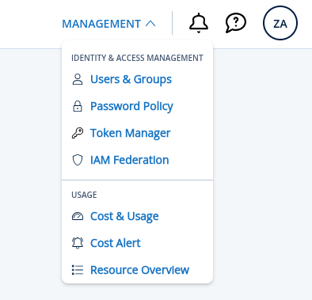
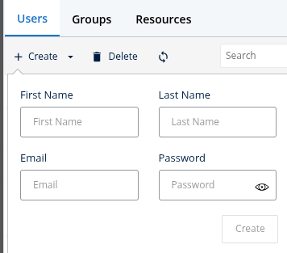
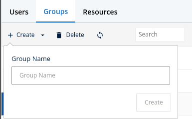
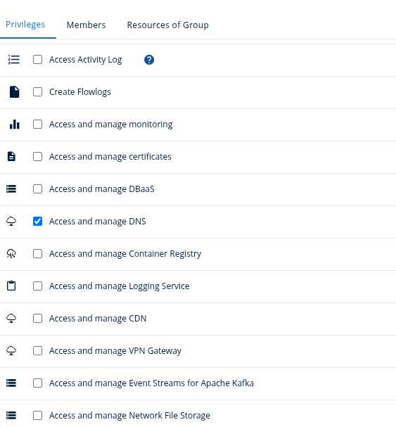
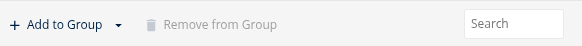

# Creating a Bot User in IONOS Datacenter Designer

This guide explains how to create a restricted user account in IONOS Datacenter Designer with access limited to DNS management. This bot user is intended for use with cert-manager's IONOS webhook for automated certificate validation.

## Overview

A bot user account allows cert-manager to authenticate to IONOS Cloud and manage DNS records without granting full account access. By scoping privileges to "Access and manage DNS," the bot user can only:
- Read DNS zones
- Create and delete DNS records (required for ACME DNS-01 challenges)
- Cannot access billing, users, or other account resources

## Prerequisites

- An IONOS Cloud account with Administrator or User Management permissions
- Access to the IONOS Datacenter Designer at https://dcd.ionos.com/

## Step-by-Step Instructions

### 1. Log in to IONOS Datacenter Designer

Navigate to https://dcd.ionos.com/ and log in with your account credentials (the account that owns the domains you'll manage).

### 2. Access User Management

1. Click your **MANAGEMENT** in the top-right corner
2. Select **Users & Groups**

1. Click **Users** to view existing users

### 3. Create a New User

1. Click on **+Create** button
2. Fill in the user details:
   - **First and Last Name**: Give the user a descriptive name (e.g., `cert-manager-bot` or `webhook-automation`)
   - **Email**: Enter an email address (can be a noreply address; it's used for login and password recovery)
   - **Password**: Generate a strong password.

  
### 4. Configure Privileges

After creating the user, you need to restrict its permissions to DNS management only:

1. Find the newly created user in the users list
2. Click on the user to see the user's information
3. On the right side, click on the **Groups** tab
4. If the user is new, the **Groups** list should be empty

We should now create a new group with **Access and manage DNS** privileges:
1. Go to the **Groups** tab in the upper panel and click on **+Create**

2. Give the group a name and click on **Create**
3. Click on the group name from the groups list
4. You should see on the right side a tab with the privileges list
5. Tick "Access and manage DNS" checkbox

After creating the group, we need to add our bot user to the group:

1. Click on the **Members** tab, and click on **+ Add to Group**

2. Select the user we created

### 5. Verify Permissions

1. Log in to the IONOS Datacenter Designer
2. The user should NOT have access to:
   - Billing or invoicing
   - User/account management
   - Infrastructure or computing resources
   - Other sensitive areas

## Security Best Practices

1. **Principle of Least Privilege**: The bot user should only have DNS management permissions
2. **Strong Passwords**: Use a password generator for the initial password
3. **Audit Access**: Monitor bot user activity in the IONOS Datacenter Designer activity logs if available
4. **Separate Environments**: Create different bot users for staging and production
5. **Secret Storage**: Store the credentials securely
